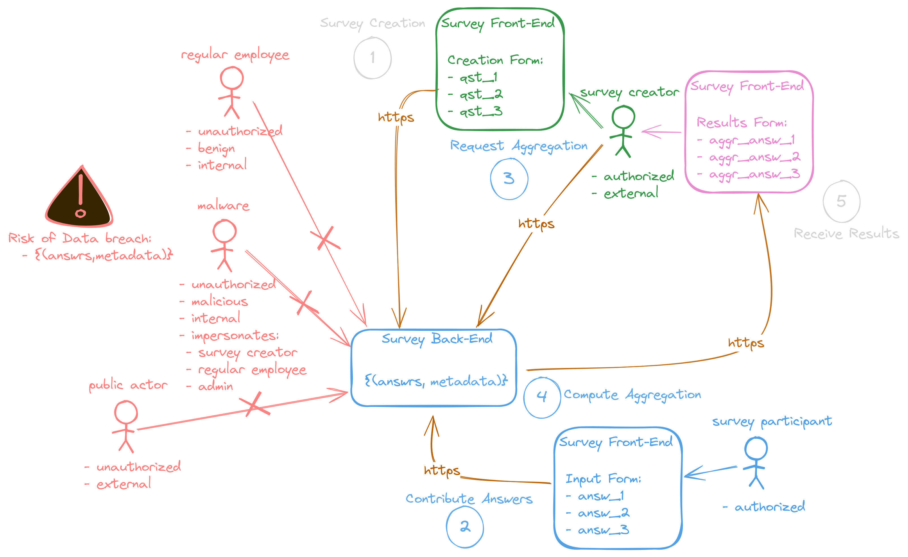
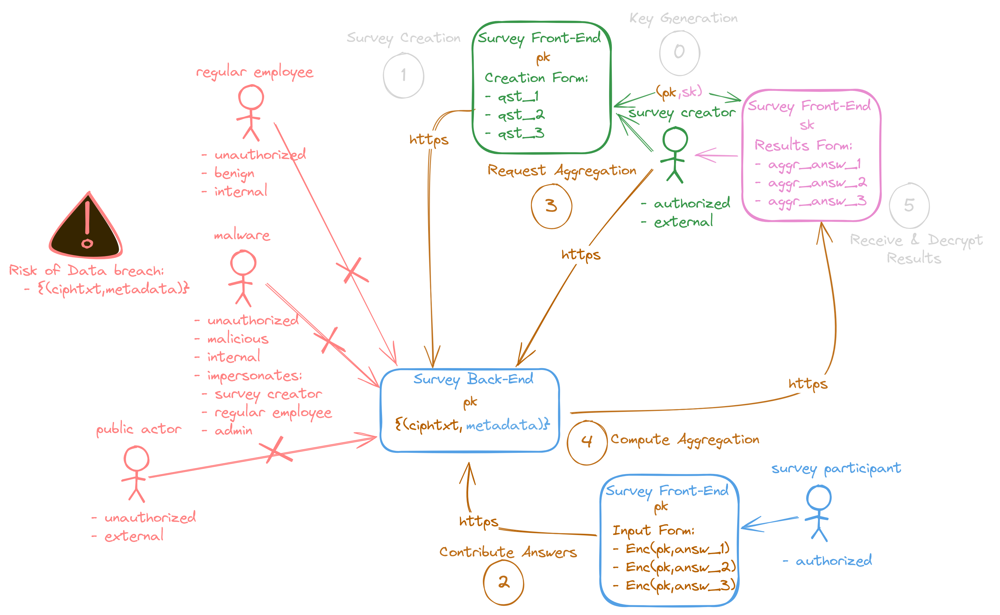

# Introduction & Motivation
This tutorial will describe how to setup your own encrypted survey webapp leveraging the API engine.

## Prior Knowledge
The main motivation for the API engine was to reduce the required cryptographical expertise threshold for developers to being able to implement or enhance web applications with homomorphic encryption. That being said the least requirement for the target audience of this tutorial is to understand what web development means. You should be at least familiar with terminologies such as API, Endpoint, GET/POST or some other HTTP(S) Requests, URL, Javascript, HTML and so on. Also some basic understanding of security concepts would be very helpful in understanding why and what you are doing here. 

>The good part is you dont need to understand how homomorphic encryption actually works. Only that it's an asymmetric encryption scheme and that there are public and secret keys involved, where the public key is public and the secret key should remain secret **and ideally the secret key is not in the same hands as the ciphertexts you are sending to. (Otherwise you security guarantees are void and the webapp is useless)** 

Have fun!

## Structure, Process and Risks of a General Survey WebApp
The following diagram is an example of a regular generic survey webapp (without any encryption) that is deployed within the same organisation as the survey participants and survey creators belong to. 

The legend is the following:
- Circle + Text --> Processing steps.
- <font color="#add8e6">BLUE: Personal Data / Personally Identifiable Data (PII) of various sensitivity levels that can be linked to the survey participant, i.e. the **data subject**</font>
- <font color="green">GREEN: Parties that are authorized to interact with the personal data of our data subjects.</font>
- <font color="#a13684">VIOLET: "Anonymous" data, i.e. not linkable to the **data subject** (irreversibly)</font> (<font color="gray">Currently under heavy debate on how to prove that the presumably anonymous data is (A) not linkable and (B) irreversible)</font>
- <font color="red">RED: Parties that are unauthorized to interact with the personal data of our data subjects.</font>
- <font color="#af593e">BROWN: Encrypted (or according to GDPR -- Pseudonymous) Data, which is most of the time TLS-traffic. But later in the tutorial it will spread.</font>

The overall process is simple and straight forward.
1. A survey participant requests the survey form and contributes (HTTPS) answers.
2. A survey creators decides that time is over and it is time to get the survey results, i.e., compute the aggregation.
3. The Back-End computes the aggregation. 
4. The survey creators gets the results of the aggregation.

The obvious risks/attack vectors are:
- Malicious Intrusion: Malware that leaks the data or maybe even ask for ransom prior to leaking the data.
- Internal Adversary: Regular employee abusing access.
- Human Error: Admin or other authorized employees unintentionally leaking access for a public actor due to human error.

Not so obvious may be:
- Output Privacy: Eventually (if the results returned to survey creator are not all aggregated or the sample size is too small), the survey creator may constitute a fourth risk/attack vector. 

> In this tutorial we will see how we can address the first 3 risks, i.e., Malicious Intrusion, Interal Adversary, Human Error. The 4th risk can be adressed too by the means of e.g. Differential Privacy. In the future i will provide additional tutorial on how to do this too in addition to the encryption. It's important to note here that Proection measures against the 4th risk such as Differential Privacy do not necessarily protect against risks 1,2,3 because their countermeasures such as homomorphic encryption are about ``Input Privacy``. So usually you want to use both mechanisms in conjunction.

##  Structure, Process and Risks of a General Encrypted Survey WebApp
As you can see the changes of the overall processing are minimal. There is only the additional step of the key generation within the Survey Creation Front-End component.

The main component is now that the Survey Front-End Component at the **Data Subject** side encrypts the answers **homomorphically** before contributing them to the Back-End. This allows the Back-End to aggregate the encrypted answers, i.e. **ciphertexts/ciphtxts** or as GDPR practioneers call them **pseudonyms**, in the same way as it was being done before (albeit now we do not compute the "simple" arithmetic **+**, but the **homomorphic encryption +**, which is from a cryptologists perspective one of the most trivial things among the standard **+**).

So how does this tackle the 3 previously mentioned attack vectors?
- Malicious Intrusion: The malware learns only the ciphertexts, while the secret key remains out of reach on the end-device of the survey creator. (Ideally it is deleted after the decryption) 
- Internal Adversary: Same as the first category.
- Human Error: Same as the first category. 

This is due to the **honest-but-curious** attacker model, where it is assumed that any actor gaining access to the encrypted data does so only passively and does not try to manipulate the data. Protections against an **active** adversary are *somewhat* possible, but out-of-scope for this tutorial.

# So How to Create the Encrypted Survey WebApp?
First of all we need to understand how the API engine [encproc](https://github.com/collapsinghierarchy/encproc) works. The construction of the encrypted survey webapp will follow then straight forwardly because it's simply one of the most simple use-cases for the engine and the homomorphic encryption in general. You can find a ready-to-use example in the [demo](https://github.com/collapsinghierarchy/encproc-decryptor/tree/main/survey%20demo) repository.

If you don't want to use the engine, then you can try to use the homomorphic encryption [lattigo](https://github.com/tuneinsight/lattigo) directly and build your own server. The API engine does not bring nothing special to the table. It is a simple wrapper around the lattigo library.

## The API Engine EncProc
In our survey webApp the engine will take the role of the **Survey Back-End** that is self-hosted within the organisation. 

> **Note:** Alternative architectures may be plenty. For example you can use your already existing **not-encrypted** survey webApp and enhance it with the API engine for aggregating the ciphertexts. This will have the positive side-effect of **data minimization** and **separation of duties** such that the encrypted data processing API engine does not receive any client-linkable meta-data of the survey participants.

### Setup EncProc
For the sake of simplicity of this tutorial we refer to the general setup of the engine to the [README](https://github.com/collapsinghierarchy/encproc) of the according repository. For this tutorial we will be using an already running instance of encproc ``http://217.154.80.44:8080``. The survey [demo](https://github.com/collapsinghierarchy/encproc-decryptor/tree/main/survey%20demo) example is already pre-configured to use this instance. 
You can try to access the URL from your browser and you will receive ``heyho`` back in case it's up and running.

### Communicate with EncProc

The essential API endpoints for the encrypted webApp are the following:

- **`POST /create-stream`**:  
  Create a new data stream. This endpoint requires a valid JWT token and a properly generated public key. It returns the registered stream ID.

- **`POST /contribute/aggregate/{id}`**:  
  Contribute encrypted data to a specific stream identified by `{id}`.

- **`GET /snapshot/aggregate/{id}`**:  
  Retrieve the aggregated result of a specific stream identified by `{id}`.

- **`GET /public-key/{id}`**:  
  Retrieve the public key associated with a specific stream identified by `{id}` for encryption purposes.

## The Encrypted WebApp
Bringing back the picture from above:

You can see the sequence of functions that we will need to implement on the client-side of a <font color="#add8e6">Survey Participant</font> and a <font color="green">Survey Creator</font>. The functional requirements are therefore structured as follows:
- The survey creator will need to
    - **SC_REQ1** Generate a keypair.
    - **SC_REQ2** Create a survey form.
    - **SC_REQ3** Send the public key to the back-end.
    - **SC_REQ4** Request & receive the encrypted aggregated results.
    - **SC_REQ5** Decrypt the aggregated results.
    
- The survey participant will need to
    - **SP_REQ1** Request and fill our the survey form.
    - **SP_REQ2** Receive the according public key.
    - **SP_REQ3** Encrypt and send the answers.

- The survey back-end will need to
    - to do a lot of stuff about which we do not care about in this tutorial. If you are interested you can look into the [encproc implementation](https://github.com/collapsinghierarchy/encproc)

In order to implemented a **minimal** webapp that meets all of these requirements we will need to implement several components.

> This is only a minimal version of such a webapp that fits a simple tutorial. I hope that the reader understands that there are many more aspects that needs to be implemented for a user friendly survey web app. My hope is that people do exactly this after the tutorial ^^

- The survey creator front-end
    - HTML+Javascript+WASM(from GO)
- The survey participant front-End
    - HTML+Javascript+WASM(from GO)
  
>Theoretically you can create the WASM modules out of any other homomorphic encryption library (rust/c++ et al.). In this tutorial we, however, will use [lattigo](https://github.com/tuneinsight/lattigo) and the pre-compiled WASM modules from the [encproc](https://github.com/collapsinghierarchy/encproc/tree/main/static) static ressources. You can request these resources easily from the URL ``http://217.154.80.44:8080/static/``. 
### Survey Participant Front-End
The story here is pretty straight forward. You will need some input forms for the answers and a encrypt & send button. Create a ``form.html`` file. The html for this might look like this:
```HTML
 <form id="contributionForm">
      <div class="form-group">
        <div class="input-container">
        <label for="qst1">Qst1</label>
          <input type="number" id="qst1" name="qst1" placeholder="1-10" required min="1" max="10">
        </div>
        <div class="description">
          <p>
            legitimate answer range 1-10
          </p>
        </div>
      </div>
      <button type="submit">Submit</button>
      <p id="error" class="error" style="display: none;">An error occurred. Please try again.</p>
    </form>
  </div>
```
Now you need an according listener that reads the answers, encrypts them and sends the ciphertexts to the API engine for aggregation. The public key request for a specific stream ID (which is integrated in this tutorial as a static variable) is a simple GET Request.

```HTML
 <script>
// Global variable to store the public key.
let publicKey = "";
// Replace with the actual stream ID as needed.
const id = "E9BA0A40C6";
fetch(`http://217.154.80.44:8080/public-key/${id}`)
  .then(response => {
    if (!response.ok) throw new Error("Failed to fetch public key");
    return response.json();
  })
  .then(data => {
    publicKey = data.publicKey;
    console.log("Public key loaded:", publicKey);
  })
  .catch(err => console.error("Error fetching public key:", err));
</script>
```

For the encryption functionality we will need to setup the javascript WASM envinroment for go compiled modules. For this you will need first to integrate the ``wasm_exec.js`` from your go installation that matches the go version of the environment, where the go modules were compiled into WASM modules. You can find the necessary ``wasm_exec.js`` for this tutorial in the [demo](https://github.com/collapsinghierarchy/encproc-decryptor/tree/main/survey%20demo) directory. Simply copy this file into the directory, where your ``form.html`` resides and add the script to the ``form.html`` file.
```HTML  
<script src="./wasm_exec.js"></script>
```
Now we need to add an suitable listener for the decryption button that decrypts the ciphertext with the imported secret key. For this we will need to load the according ``encryption_module.wasm`` from the API engine. 
```Javascript
// Load and initialize the Wasm module.
const go = new Go();
const wasmModule = await WebAssembly.instantiateStreaming(
  fetch("http://217.154.80.44:8080/static/encryption_module.wasm"),
  go.importObject
);
go.run(wasmModule.instance);
```
Calling of the javascript exported function ``eng_push(answer)`` from the ``encryption_module.wasm`` in order to encrypt the answer can be done in the following way within your listener:
```Javascript
// Call WASM `eng_push` function for each input value.
  eng_push(qst1); 
```
Finally you need to a listener for the submission to trigger the encryption and submit the results to the API engine.
```Javascript
  // Form submission handler.
    document.getElementById("contributionForm").addEventListener("submit", async (event) => {
      event.preventDefault();

      // Get form data.
      const priv = parseInt(document.getElementById("qst1").value, 10);

      // Validate that the inputs are numbers between 1 and 10.
      if ( isNaN(qst1) || qst1 < 1 || qst1 > 10) {
        alert("Please enter valid numbers between 1 and 10 for both fields.");
        return;
      }

      // Ensure the public key has been loaded.
      if (!publicKey) {
        alert("Public key not loaded yet. Please try again later.");
        return;
      }

      // Load and initialize the Wasm module.
      const go = new Go();
      const wasmModule = await WebAssembly.instantiateStreaming(
        fetch("http://217.154.80.44:8080/static/encryption_module.wasm"),
        go.importObject
      );
      go.run(wasmModule.instance);

      // Call WASM `eng_push` function for each input value.
      eng_push(qst1); // Push with the privacy preference.

      // Encrypt the data using the WASM `eng_encrypt` function.
      const encryptedDataBase64 = eng_encrypt(publicKey);

      // Prepare the payload.
      const payload = JSON.stringify({ id, ct: encryptedDataBase64});

      // Send the encrypted data to the API.
      const response = await fetch(`http://217.154.80.44:8080/contribute/aggregate/${id}`, {
        method: "POST",
        headers: { "Content-Type": "application/json" },
        body: payload,
      });

      if (response.ok) {
        alert("Data submitted successfully!");
        document.getElementById("contributionForm").reset();
      } else {
        document.getElementById("error").style.display = "block";
      }
    });
```
### Survey Creator Front-End
Overall we can split the functional requirements into two groups.
- Group A: **SC_REQ 1,2,3**
- Group B: **SC_REQ 4,5**
The split is due to the sequences of steps that need to be conducted together. 
#### Group A REQs
In this tutorial we won't bother with implementing the group A functionality in a separate html-form but will rather, for the sake of simplicity, use the ``createStream.go`` from this repository. For this you can simply run the go main with ``go run .`` inside the root directory. (It should be already pre-configured with a valid JWT-token)
If the go module exits succesfully you should see a ``keypair.json`` file that contains the secret and public keypair and the stream ID such as ``E9BA0A40C6``. In this case the go module automatically registered the public key and assigned him the stream ID that you have received back. You are ready to go for the group B functionalities.

>Optional: If you, however, would like to implement the group A functionality inside an HTML-form you will have to create a separate WASM module for key generation. Feel free to ask (encproc@gmail.com) or in our discord for support.

#### Group B REQs
>Note: If you are familiar with HTML and Javascript you will find the next 3 steps trivial. However, the 4/5/6th step is about the setup of the WASM environmentand calling the exported decryption function.

This group of functionalities concerns the decryption of the results and the snapshot query of the aggregation. Firstly create a ``results.html`` file. Then we will need to create at least a 
1. **secret key import functionality**, which can be a simple HTML ``input`` type of component for the ``keypair.json``.
```HTML  
<form id="loadKeyForm">
  <label for="secretKeyFile">Load Secret Key File</label>
  <input type="file" id="secretKeyFile" accept=".json" required>
  <button type="submit">Load Secret Key</button>
</form>
```
The imported file will contain the stream ID, the secret key and the public key ``BASE64`` encoded and within a ``JSON`` structure. In order to parse the secret key and the id you can copy the following listener.
```HTML
<script>  
    let secretKey = null;
    let id = null;
    let encryptedResults = null;
    let sampleSize = null; 

    const wasmFilePath = "http://217.154.80.44:8080/static/decrypt_results.wasm";
    
     // Load Secret Key File
    document.getElementById("loadKeyForm").addEventListener("submit", async (event) => {
      event.preventDefault();
      const fileInput = document.getElementById("secretKeyFile");
      if (fileInput.files.length === 0) {
        alert("Please select a file.");
        return;
      }
      const file = fileInput.files[0];
      const reader = new FileReader();
      reader.onload = async (e) => {
        try {
          const keyData = JSON.parse(e.target.result.trim());
          const { id: loadedID, sk: loadedSecretKey } = keyData;
          if (!loadedSecretKey || !/^[A-Za-z0-9+/=]+$/.test(loadedSecretKey)) {
            throw new Error("Invalid Base64 format in the secret key.");
          }
          if (!loadedID) {
            throw new Error("Missing or invalid ID in the key file.");
          }
          id = loadedID;
          secretKey = loadedSecretKey;
          alert("Secret key loaded successfully!");
          document.getElementById("actionButtons").style.display = "flex";
        } catch (err) {
          console.error("Error loading secret key file:", err);
          alert("Failed to load secret key file. Please check the file format.");
        }
      };
      reader.readAsText(file);
    });
</script>
``` 
2. a GET Request for **``/snapshot/aggregate/{id}``**, which we can trigger with a simple button.
```HTML  
<button id="querySnapshot">Query Snapshot Data</button>
```
For this button you can use the following listener to your existing ``<script>...</script>``. This listener takes the ID from the previously imported ``keypair.json`` and sends a GET request to the according API endpoint in order to get the current encrypted aggregate ciphertext. The returned result will contain a ``BASE64`` encoded ciphertext and the ``sample size``.
```Javascript
// Query Snapshot Data
  document.getElementById("querySnapshot").addEventListener("click", async () => {
    if (!id) {
      alert("Secret key not loaded. Please load the key first.");
      return;
    }
    try {
      const response = await fetch(`http://217.154.80.44:8080/snapshot/aggregate/${id}`, {
        method: "GET",
      });
      if (response.ok) {
        const data = await response.json();
        const { ct_aggr_byte_base64, id: responseID, sample_size } = data;
        if (!ct_aggr_byte_base64 || typeof ct_aggr_byte_base64 !== "string") {
          throw new Error("Invalid or missing 'ct_aggr_byte_base64' in the response.");
        }
        if (!responseID || responseID !== id) {
          throw new Error(`Response ID (${responseID}) does not match the loaded ID (${id}).`);
        }
        if (typeof sample_size !== "number" || sample_size < 1) {
          throw new Error("Invalid or missing 'sample_size' in the response.");
        }
        encryptedResults = ct_aggr_byte_base64;
        sampleSize = sample_size; // Store the sample_size globally
        alert(`Snapshot data fetched successfully!\nSample Size: ${sample_size}`);
      } else {
        throw new Error(`Failed to fetch snapshot data. HTTP Status: ${response.status}`);
      }
    } catch (err) {
      console.error("Error fetching snapshot data:", err);
      alert(`Failed to fetch snapshot data. ${err.message}`);
    }
  });
```
3. a decryption functionality of the aggregated ciphertext that we have received by the previous request, which we can also trigger by a simple button and we add a results container as well that will contain the view of the results.
```HTML  
<button id="decryptResults">Decrypt Results</button>
<!-- Results container -->
<div id="resultsContainer"></div>
```
4. For the decryption functionality we will need to setup the javascript WASM envinroment for go compiled modules. For this you will need first to integrate the ``wasm_exec.js`` from your go installation that matches the go version of the environment, where the go modules were compiled into WASM modules. You can find the necessary ``wasm_exec.js`` for this tutorial in the [demo](https://github.com/collapsinghierarchy/encproc-decryptor/tree/main/survey%20demo) directory. Simply copy this file into the directory, where your ``results.html`` resides and add the script to the ``results.html`` file.
```HTML  
<script src="./wasm_exec.js"></script>
```
5. Now we need to add an suitable listener for the decryption button that decrypts the ciphertext with the imported secret key. For this we will need to load the according ``decrypt_results.wasm`` from the API engine. The url is stored in the beginning of the script as a constant variable ``const wasmFilePath``. In order to load the ``.wasm`` and "activate" it you need the following javacsript code
```Javascript
const go = new Go();
const wasmModule = await WebAssembly.instantiateStreaming(fetch(wasmFilePath), go.importObject);
go.run(wasmModule.instance);
```
6. Now that the ``decrypt_results.wasm`` is loaded and activated and the secret key is imported as well, you are ready to go to trigger the decryption. You can do this by simply calling the function ``decrypt_result(encryptedResults, secretKey)``. This is due to the ``decrypt_results.wasm`` exporting the javascript function ``decrypt_results`` and running the lattigo based decryption function in Go compiled as ``WASM``.
```Javascript
const decryptedResults = decrypt_result(encryptedResults, secretKey);
```
The overall listener can now look like this:
```Javascript
document.getElementById("decryptResults").addEventListener("click", async () => {
      if (!secretKey || !encryptedResults) {
        alert("Ensure the secret key is loaded and snapshot data is fetched.");
        return;
      }
      try {
        //---------------- WASM environment --------------------------
        const go = new Go();
        const wasmModule = await WebAssembly.instantiateStreaming(fetch(wasmFilePath), go.importObject);
        go.run(wasmModule.instance);
        //------------------------------------------------------------
        
        //---------------- decrypt_results.wasm exported function call ------------------------   
        const decryptedResults = decrypt_result(encryptedResults, secretKey);
        //------------------------------------------------------------------
        console.log("Decrypted Results:", decryptedResults);
        alert("Decryption successful! Check the results below.");

        // Process decrypted results to show only the first two numbers.
        // Assuming decryptedResults is a comma-separated string.
        const numbers = decryptedResults.split(',');
        const qst1 = numbers[0] ? numbers[0].trim() : "N/A";
        const qst2 = numbers[1] ? numbers[1].trim() : "N/A";

        // Build the results HTML with sample size and descriptions.
        const resultsHtml = `
          <h2>Aggregated Results</h2>
          <p><strong>Sample Size:</strong> ${sampleSize}</p>
          <p>
            <strong>Qst1:</strong> ${qst1}<br>
            <em>Description of the question 1</em>
          </p>
          <p>
            <strong>Qst2:</strong> ${qst2}<br>
            <em>Description of the question 1</em>
          </p>
        `;
        const resultsContainer = document.getElementById("resultsContainer");
        resultsContainer.style.display = "block";
        resultsContainer.innerHTML = resultsHtml;
      } catch (err) {
        console.error("Error decrypting results:", err);
        alert("Failed to decrypt the results.");
      }
    });
```